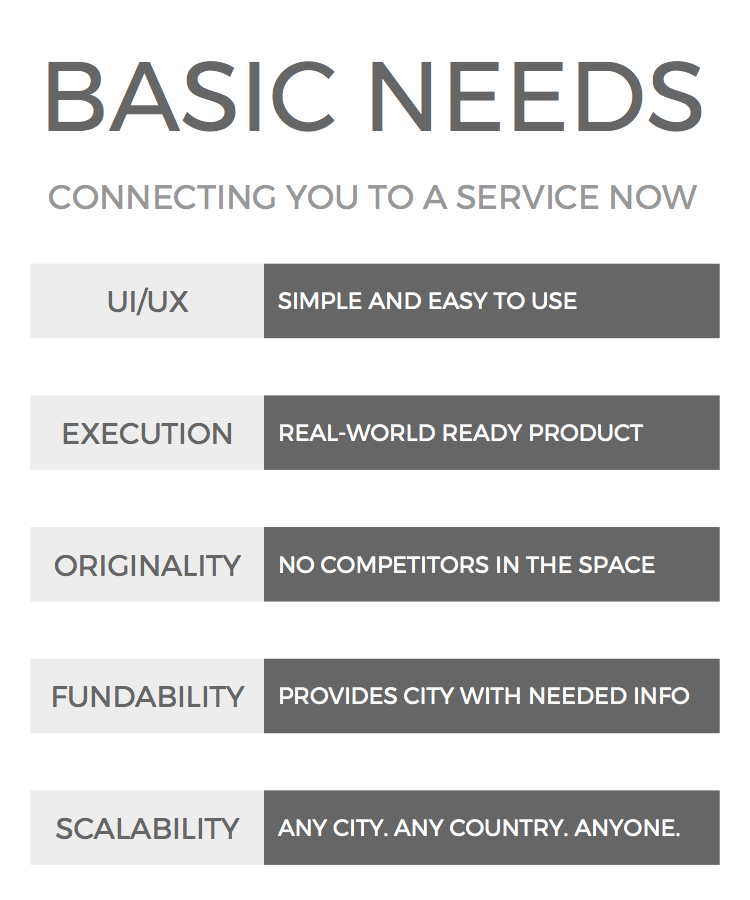

# Basic Needs

### Description
 
Our SMS-based application provides access to routing, emergency, mental health, sanitation, education, location, weather, and feedback services to vulnerable populations without wifi dependency. Basic Needs addresses immediate needs, connects vulnerable populations to their needs, and initiates a dialog between cities and vulnerable populations for social engagement and improvement.

### Demo

### Technical Details
Basic Needs is a tool which communicates information between user and information via Twilio and an Amazon Lex chatbox. Our case study is completed on the city of Seattle. Data is extracted from HERE API calls, Seattle Public Data (ie. weather), and scraped wifi data.

### Competitive Overview

### File Structure

* aws_lambda: folder for AWS Lambda code to communicate with Lex
  * HomelessHelper.py: lambda_handler for controlling lambda functions
* here_API_calls: supporting Data
  * here API calls to Git.ipynb: iPython Notebook for basis of all data collection
  * .csv files: supporting data files
* images: relevant pictures for this project

### Team Members

* [Brett Bejcek](https://www.linkedin.com/in/brettbejcek/)
* [Mayuree Binjolkar](https://www.linkedin.com/in/mayuree-binjolkar-974a7133/)
* [Yana Sosnovskaya](https://www.linkedin.com/in/yasosnovskaya/)
* [Orysya Stus](https://www.linkedin.com/in/orysyastus/)

MIT License

Copyright (c) 2017 Basic Needs Project Team

Permission is hereby granted, free of charge, to any person obtaining a copy
of this software and associated documentation files (the "Software"), to deal
in the Software without restriction, including without limitation the rights
to use, copy, modify, merge, publish, distribute, sublicense, and/or sell
copies of the Software, and to permit persons to whom the Software is
furnished to do so, subject to the following conditions:

The above copyright notice and this permission notice shall be included in all
copies or substantial portions of the Software.

THE SOFTWARE IS PROVIDED "AS IS", WITHOUT WARRANTY OF ANY KIND, EXPRESS OR
IMPLIED, INCLUDING BUT NOT LIMITED TO THE WARRANTIES OF MERCHANTABILITY,
FITNESS FOR A PARTICULAR PURPOSE AND NONINFRINGEMENT. IN NO EVENT SHALL THE
AUTHORS OR COPYRIGHT HOLDERS BE LIABLE FOR ANY CLAIM, DAMAGES OR OTHER
LIABILITY, WHETHER IN AN ACTION OF CONTRACT, TORT OR OTHERWISE, ARISING FROM,
OUT OF OR IN CONNECTION WITH THE SOFTWARE OR THE USE OR OTHER DEALINGS IN THE
SOFTWARE.
